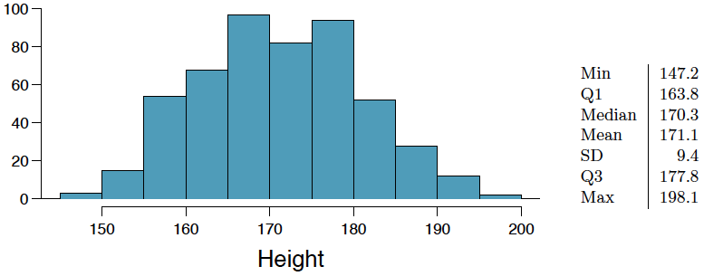
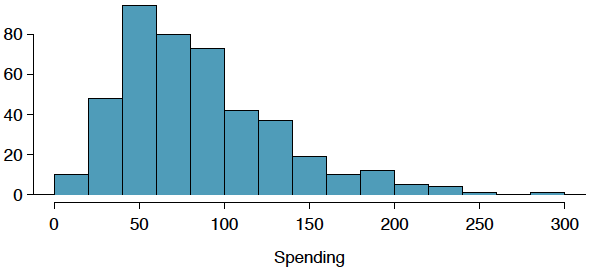
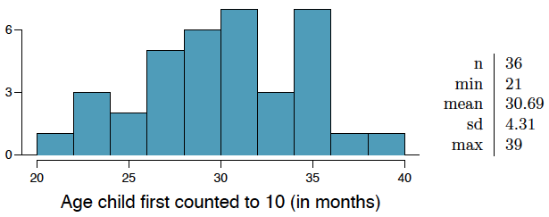
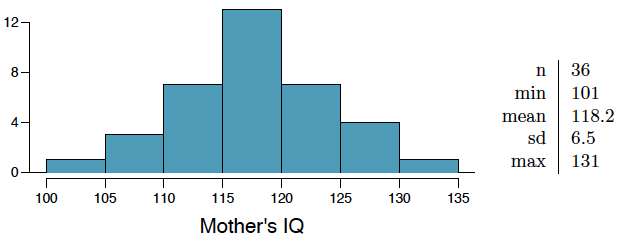

```{r setup, include=FALSE}
knitr::opts_chunk$set(echo = TRUE)
```

Graded: 4.4, 4.14, 4.24, 4.26, 4.34, 4.40, 4.48

## Exercise 4.4 Heights of adults

Researchers studying anthropometry collected body girth measurements and skeletal diameter measurements, as well as age, weight, height and gender, for 507 physically active individuals. The histogram below shows the sample distribution of heights in centimeters.



#####  (a) What is the point estimate for the average height of active individuals? What about the median?

The sample mean of 171.1 is the point estimate for the average height of active individuals and the sample median of 170.3 is the point estimate for the median height of active individuals.

#####  (b) What is the point estimate for the standard deviation of the heights of active individuals? What about the IQR?

The sample standard deviation of 9.4 is the point estimate for the standard deviation of the heights of active individuals and the sample IQR of 14 is the point estimate for the population IQR. 

#####  (c) Is a person who is 1m 80cm (180 cm) tall considered unusually tall? And is a person who is 1m 55cm (155cm) considered unusually short? Explain your reasoning.

No, a person who is 1m 80cm (180 cm) tall would not be considered unusually tall since 180 cm is not far from the center of the distribution of heights in our sample.  Yes, a person who is 1m 55cm (155cm) probably would be considered unusually short since 155 cm is on the far left tail of the sample distribution of heights.

#####  (d) The researchers take another random sample of physically active individuals. Would you expect the mean and the standard deviation of this new sample to be the ones given above? Explain your reasoning.

No, I would not expect the mean and standard deviation of this new sample to be the same as the mean and standard deviation of my original sample, but I would expect them to be similar.  Since the sample is chosen at random, the individual observations would not be the same, but they should be representative of the population in the same way that the original sample is.

#####  (e)The sample means obtained are point estimates for the mean height of all active individuals, if the sample of individuals is equivalent to a simple random sample. What measure do we use to quantify the variability of such an estimate (Hint: recall that $SD\bar{x} = \frac{\sigma}{\sqrt{n}}$)? Compute this quantity using the data from the original sample under the condition that the data are a simple random sample.

We can quantify the variability of the sample mean as an estimates of the population mean by calculating the **standard error**, which is approximately 0.417.

```{r}
SDx = 9.4/sqrt(507)
round(SDx, 3)
```


## Exercise 4.14 Thanksgiving spending, Part I

The 2009 holiday retail season, which kicked off on
November 27, 2009 (the day after Thanksgiving), had been marked by somewhat lower self-reported consumer spending than was seen during the comparable period in 2008. To get an estimate of consumer spending, 436 randomly sampled American adults were surveyed. Daily consumer spending for the six-day period after Thanksgiving, spanning the Black Friday weekend and Cyber Monday, averaged \$84.71. A 95% confidence interval based on this sample is (\$80.31, $89.11). Determine whether the following statements are true or false, and explain your reasoning.



#####  (a) We are 95% confident that the average spending of these 436 American adults is between $80.31 and $89.11.

False, we are 95% confident that the average spending of ALL American adults is between \$80.31 and $89.11.

#####  (b) This confidence interval is not valid since the distribution of spending in the sample is right skewed.

I'm going to say false because it is only not valid if the sample is ***strongly*** skewed.  The textbook didn't give a very good explanation of how to judge whether a distribution is too skewed to be well approximated by a normal model.   Based on the histograms of other examples in the book, I am going to say this one is not too strongly skewed.

#####  (c) 95% of random samples have a sample mean between $80.31 and $89.11.

False, we cannot use the confidence interval to make any assumptions about other sample means.

#####  (d) We are 95% confident that the average spending of all American adults is between $80.31 and $89.11.

True, that is what a confidence interval is used for, to describe how confident we are that the corresponding population parameter falls within the confidence interval.

#####  (e) A 90% confidence interval would be narrower than the 95% confidence interval since we don’t need to be as sure about our estimate.

True, a 90% confidence interval would be narrower than a 95% confidence interval since a smaller interval would make us less certain.  By widening the confidence interval we are essentially widening the 'net' with which we are trying to catch the population parameter making it more likely that we will catch it. 

#####  (f) In order to decrease the margin of error of a 95% confidence interval to a third of what it is now, we would need to use a sample 3 times larger.

False, we would need to make our sample 9 times larger in order to have a confidence interval that is a third of what it is now since we would need the square root of our sample size to be 3 times it's current value in order to triple the standard error.  

```{r}
# current margin of error is 4.4 we want it to be 1/3 of that or about 1.466
# figure out the current SE so we can use it to calculate the population standard deviation
SE = 4.4/1.96
SE
# SE = sigma/sqrt(436)
sigma <- SE * sqrt(436)
# sigma is our population standard deviation
sigma

# multiply the sample size by 9 to get one third the current SE
newSE <- sigma/sqrt(436*9)
newSE
# Show that this results in our target margin of error
1.96 * newSE
```


#####  (g) The margin of error is 4.4.

True, the margin of error is 4.4 since our confidence interval is equal to our point estimate plus and minus the margin of error.

```{r}
(89.11 - 84.71)
```

## Exercise 4.24 Gifted children, Part I

Researchers investigating characteristics of gifted children collected data from schools in a large city on a random sample of thirty-six children who were identified as gifted children soon after they reached the age of four. The following histogram shows the distribution of the ages (in months) at which these children first counted to 10 successfully. Also provided are some sample statistics.



#####  (a) Are conditions for inference satisfied?

Yes, since the sample observations are assumed to be independent, the sample size is larger than 30 and less than 10% of the population and the distribution does not seem to be strongly skewed, the conditions for inference are satisfied.

#####  (b) Suppose you read online that children first count to 10 successfully when they are 32 months old, on average. Perform a hypothesis test to evaluate if these data provide convincing evidence that the average age at which gifted children first count to 10 successfully is less than the general average of 32 months. Use a significance level of 0.10.

$H_0$: The average age that gifted children first count to 10 is the same as that of the general population, $\mu_g = 32$ months.

$H_A$: The average age that gifted children first count to 10 is less than that of the general population, $\mu_g < 32$ 32 months.

```{r}
z = (30.69 - 32) / 4.31
z
```

```{r message=FALSE}
library(DATA606)
normalPlot(mean = 0, sd = 1, bounds = c(-Inf,z), tails = FALSE)
```

Since our P value of .381 is greater than our significance level of .1 we fail to reject the null hypothesis.  There is not enough statistical evidence to support our alternative hypothesis.  

#####  (c) Interpret the p-value in context of the hypothesis test and the data.


#####  (d) Calculate a 90% confidence interval for the average age at which gifted children first count to 10 successfully.

```{r}
lb <- round(30.69 - 1.65*4.31, 2)
ub <- round(30.69 + 1.65*4.31, 2)
lb
ub
```


#####  (e) Do your results from the hypothesis test and the confidence interval agree? Explain.

Yes, my confidence interval shows that the mean of 32 would be captured by my confidence interval from 23.58 to 37.8 so there is a good possibility that the difference in means is due to random sampling and not statistically significant.

## Exercise 4.26 Gifted children, Part II

Exercise 4.24 describes a study on gifted children. In this study, along with variables on the children, the researchers also collected data on the mother’s and father’s IQ of the 36 randomly sampled gifted children. The histogram below shows the distribution of mother’s IQ. Also provided are some sample statistics.



#####  (a) Perform a hypothesis test to evaluate if these data provide convincing evidence that the average IQ of mothers of gifted children is different than the average IQ for the population at large, which is 100. Use a significance level of 0.10.

$H_0$: The average IQ of mothers of gifted children is the same as that of the general population, $\mu_g = 100$ months.

$H_A$: The average average IQ of mothers of gifted children is different than that of the general population, $\mu_g \neq 100$ 32 months.

```{r}
z = (118.2 - 100) / 6.5
z
```

```{r message=FALSE}
normalPlot(mean = 0, sd = 1, bounds = c(-z,z), tails = TRUE)
P = 1-.995
P
```

A P value of .005 is less than our significance level of .1, so we reject the null hypothesis in favor of the alternative hypothesis.  There is statistical evidence that the IQ of the mothers of gifted children is different than that of the general population.

#####  (b) Calculate a 90% confidence interval for the average IQ of mothers of gifted children.

```{r}
lb <- round(118.2 - 1.65*6.5, 2)
ub <- round(118.2 + 1.65*6.5, 2)
lb
ub
```

#####  (c) Do your results from the hypothesis test and the confidence interval agree? Explain.

Yes, the average IQ of mother's in teh general population does not fall within the 90% confidence interval of the mean IQ of mothers of gifted children.

## Exercise 4.34 CLT

**Define the term “sampling distribution” of the mean, and describe how the shape,
center, and spread of the sampling distribution of the mean change as sample size increases.**

The sampling distribution of the mean is the distribution that would be created by repeatedly taking random samples from a population and calculating the mean and then creating a distribution from all the resulting mean values.  As the sample size increases, the distribution gets taller and skinnier with the center always the same at the population mean, but the range decreasing as the sample size is increased.

## Exercise 4.40 CFLBs

A manufacturer of compact fluorescent light bulbs advertises that the distribution of the lifespans of these light bulbs is nearly normal with a mean of 9,000 hours and a standard
deviation of 1,000 hours.

#####  (a) What is the probability that a randomly chosen light bulb lasts more than 10,500 hours?

```{r}
z <- (10500-9000)/1000
z
```
```{r}
normalPlot(mean = 0, sd = 1, bounds = c(-Inf,z), tails = FALSE)
```

```{r}
P <- 1-0.933
P
```

The probability that a randomly chosen light bulb lasts more than 10,500 hours is 0.067.

#####  (b) Describe the distribution of the mean lifespan of 15 light bulbs.


#####  (c) What is the probability that the mean lifespan of 15 randomly chosen light bulbs is more than 10,500 hours?


#####  (d) Sketch the two distributions (population and sampling) on the same scale.


#####  (e) Could you estimate the probabilities from parts (a) and (c) if the lifespans of light bulbs had a skewed distribution?


## Exercise 4.48 Same observation, different sample size

**Suppose you conduct a hypothesis test based on a sample where the sample size is n = 50, and arrive at a p-value of 0.08. You then refer back to your notes and discover that you made a careless mistake, the sample size should have been n = 500. Will your p-value increase, decrease, or stay the same? Explain.**

Because you sample size increased your standard error is decreased, so the number of standard deviations your sample statistic is away from the population parameter would increase, and your p value would be much smaller. 