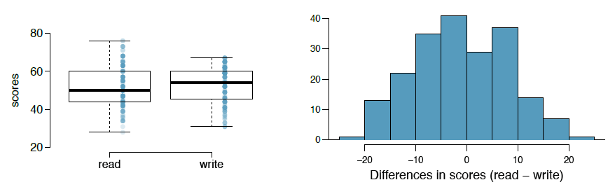
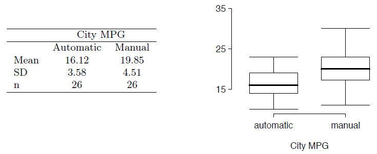
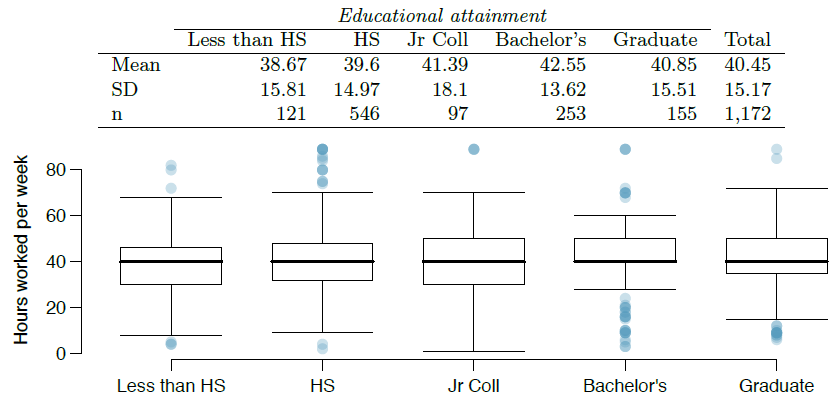
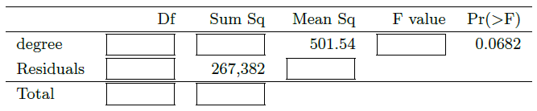

```{r setup, include=FALSE}
knitr::opts_chunk$set(echo = TRUE)
```

Graded: 5.6, 5.14, 5.20, 5.32, 5.48

## Exercise 5.6 Working backwards, Part II

A 90% confidence interval for a population mean is (65, 77). The population distribution is approximately normal and the population standard deviation is unknown. This confidence interval is based on a simple random sample of 25 observations. Calculate the sample mean, the margin of error, and the sample standard deviation.

The sample mean would be exactly in the middle between the upper and lower bounds of the confidence interval, so...

```{r}
# Sample Mean
mu = (65 + 77) / 2
mu
```

###### The sample mean is 71.

If we have a 90% confidence interval then the difference of each of the bounds from the mean is equal to the margin of error and is also equal to $t^{\star}$ times the standard error which is the sample standard deviation divided by the square root of $n$. 

```{r}
# Calculate the Margin or Error
ME <- 77-71
ME
# Calculate the T-score
t <- qt(.05, df=24)
t
# Use the t-score to calculate the sample standard error
s = ME/t * sqrt(25)
round(s, 2)
```

###### The margin of error is 6 and our sample standard deviation is approximately 17.53

## Exercise 5.14 SAT scores

SAT scores of students at an Ivy League college are distributed with a standard deviation of 250 points. Two statistics students, Raina and Luke, want to estimate the average SAT score of students at this college as part of a class project. They want their margin of error to be no more than 25 points. 

#####  (a) Raina wants to use a 90% confidence interval. How large a sample should she collect? 

For a confidence interval of 90% we want our ME which equals $1.65 \times \frac{250}{\sqrt{n}}$ to be less than 25.

```{r}
z <- qnorm(.95, mean = 0, sd = 1)
n <- ((z^2) / (25^2)) * 250^2
ceiling(n)
```

###### Raina needs a sample of at least 271 students to be 90% confident that her estimate is within 25 points of the actual population mean.

#####  (b) Luke wants to use a 99% confidence interval. Without calculating the actual sample size, determine whether his sample should be larger or smaller than Raina's, and explain your reasoning.

###### Luke's sample should be larger than Raina's if he wants a greater confidence in his estimate since a larger sample would give a more accurate estimate of the poopulation.

#####  (c) Calculate the minimum required sample size for Luke.

```{r}
z <- qnorm(.995, mean = 0, sd = 1)
n <- ((z^2) / (25^2)) * 250^2
ceiling(n)
```

###### Luke needs a sample of at least 664 students to be 99% confident that his estimate is within 25 points of the actual population mean.

## Exercise 5.20 High School and Beyond, Part I

The National Center of Education Statistics conducted a survey of high school seniors, collecting test data on reading, writing, and several other subjects. Here we examine a simple random sample of 200 students from this survey. Side-by-side box plots of reading and writing scores as well as a histogram of the differences in scores are shown below.



#####  (a) Is there a clear difference in the average reading and writing scores?

There is no clear difference in the average reading and writing scores based on the boxplots and histogram of the distribution of differences alone.  The distribution looks fairly normal centered around zero and the boxplots have similar medians and variances.

#####  (b) Are the reading and writing scores of each student independent of each other?

No they are paired observations since each case has both a reading and a writing score.

#####  (c) Create hypotheses appropriate for the following research question: is there an evident difference in the average scores of students in the reading and writing exam?

$H_0: \mu_{diff} = 0$  -- There is no difference in the average scores of students in the reading and writing exams.

$H_A: \mu_{diff} \neq 0$ -- There is a difference in the average scores of students in the reading and writing exams.

#####  (d) Check the conditions required to complete this test.

  1. Since our differences were taken from a random sample (and are presumably less than 10% of the population) they are independent.
  2. They appear to be nearly normal and the sample size is greater than 30 so the normality condition is satisfied

#####  (e) The average observed difference in scores is $\bar{x}_{read-write} = -0.545$, and the standard deviation of the differences is 8.887 points. Do these data provide convincing evidence of a difference between the average scores on the two exams?

First calculate the T-score...

```{r}
SE <- 8.887/sqrt(200)
t = (-0.545-0)/SE
t
```

Then use the T-Score to calculate the P-Value...

```{r}
p = pt(q=t, df=199, lower.tail = TRUE)
2 * p
```

Since p-value greater than 0.05, we fail to reject the null hypothesis. There is not enough statistical evidence to say the difference between the average reading and writing scores is not due to normal sampling differences.

#####  (f) What type of error might we have made? Explain what the error means in the context of the application.

We have have made a Type 2 error, failing to reject the null when there is actually a difference in the students' reading and writing scores and the alternative hypothesis is true.

#####  (g) Based on the results of this hypothesis test, would you expect a confidence interval for the average difference between the reading and writing scores to include 0? Explain your reasoning.

Yes, since a p-value of .387 means that if the null hypothesis is true we would expect to get a sample with a mean difference equal to or greater than our sample mean difference about 38.7% of the time, I would expect our confidence interval to include 0 our null value.

## Exercise 5.32 Fuel efficiency of manual and automatic cars, Part I

Each year the US Environmental Protection Agency (EPA) releases fuel economy data on cars manufactured in that year. Below are summary statistics on fuel efficiency (in miles/gallon) from random samples of cars with manual and automatic transmissions manufactured in 2012. Do these data provide strong evidence of a difference between the average fuel efficiency of cars with manual and automatic transmissions in terms of their average city mileage? Assume that conditions for inference are satisfied.



```{r}
auto_mu <- 16.12
auto_s <- 3.58
man_mu <- 19.85
man_s <- 4.51
n <- 26

diff <- man_mu - auto_mu 

# standard error
se <- sqrt((auto_s^2/n) + (man_s^2/n))

# T-score
t <- (diff - 0)/se
t

p = pt(q=t, df=n-1, lower.tail = FALSE)
p
```

Since the p-value is 0.0014, there is strong evidence of a difference between the average fuel efficiency of cars with manual and automatic transmissions in terms of their average city mileage.

## Exercise 5.48 Work hours and education

The General Social Survey collects data on demographics, education, and work, among many other characteristics of US residents. Using ANOVA, we can consider educational attainment levels for all 1,172 respondents at once. Below are the distributions of hours worked by educational attainment and relevant summary statistics that will be helpful in carrying out this analysis.



#####  (a) Write hypotheses for evaluating whether the average number of hours worked varies across the five groups.

$H_0:$ The mean hours worked is the same across all educational attainment groups

$H_A:$ There is a difference in the mean hours worked in at least one group.

#####  (b) Check conditions and describe any assumptions you must make to proceed with the test.

  1. The sample is assumed to be randomly selected and is less than 10% of the population and has greater than 30 observations in each group, so it can be assumed to be independent.
  2. The boxplots appear to be mostly normal although there is appears to be a strong skew in the Bachelor's group, but since this group has 253 observations and there are no extreme outliers a strong skew is not a major concern.   
  3. The variance in the boxplots appears to be relatively consistent across groups although again the Bachelor's group has a larger difference in its variance as compared with all the other groups.

#####  (c) Below is part of the output associated with this test. Fill in the empty cells.



```{r}
# Not sure why I had to do this but my number format came out wacky if I didn't...
# Solution found here: 
# https://stackoverflow.com/questions/9397664/force-r-not-to-use-exponential-notation-e-g-e10
options(scipen = 999)

# dfg = number of groups minus 1 
dfg <- 4
# dfe = total number of cases minus the number of groups
dfe <- 1167

# Known values
MSG <- 501.54
sse <- 267382

# Calculate the missing values
MSE <- sse / dfe
ssg <- dfg * MSG
f <- MSG / MSE
dft <- dfg + dfe
sst <- ssg + sse

p <- pf(q = f, dfg, dfe, lower.tail = FALSE)
p

```

ANOVA Summary | Df       | Sum Sq  | Mean Sq | F Value  | Pr(>F)
------------- | -------- | ------- | ------- | -------- | ------
degree        | `r dfg`  | `r ssg` | `r MSG` | `r f`    | `r p`
Residuals     | `r dfe`  | `r sse` | `r MSE` |          |  
Totals        | `r dft`  | `r sst` |         |          |  

#####  (d) What is the conclusion of the test?

If we use the typical $\alpha = 0.05$ significance level then our p-value at `r round(p,2)` is greater than our significance level, so we would fail to reject the null hypothesis.  There is not enough statistical evidence to support our alternative hypothesis in favor of the null.

