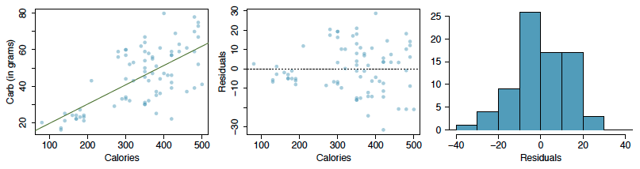
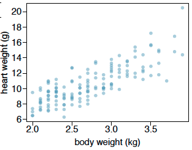
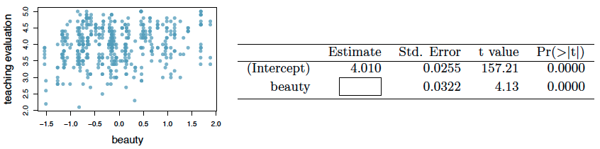
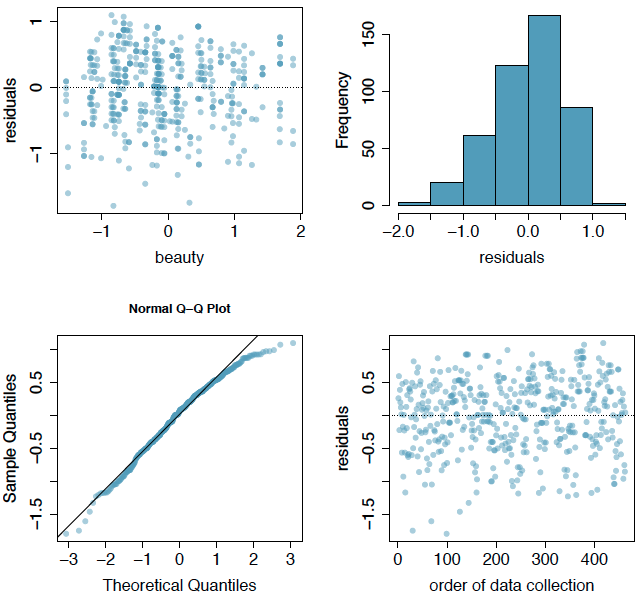

```{r setup, include=FALSE}
knitr::opts_chunk$set(echo = TRUE)
```

Graded: 7.24, 7.26, 7.30, 7.40

## Exercise 7.24 Nutrition at Starbucks, Part I

The scatterplot below shows the relationship between the number of calories and amount of carbohydrates (in grams) Starbucks food menu items contain. Since Starbucks only lists the number of calories on the display items, we are interested in predicting the amount of carbs a menu item has based on its calorie content.



#####  (a) Describe the relationship between number of calories and amount of carbohydrates (in grams) that Starbucks food menu items contain.

Generally as the calories increase so do the carbs, but there is a lot of variation, and just by visual inspection there seems to be a relatively low correlation.

#####  (b) In this scenario, what are the explanatory and response variables?

'Calories' is the explanatory variable and 'Carb' is the response variable.

#####  (c) Why might we want to fit a regression line to these data?

People on low carb diets may be interested in knowing how many of the calories in a menu item are from carbs vs. from fat or protein.  

#####  (d) Do these data meet the conditions required for fitting a least squares line?

No, the residuals plot shows that the variance seems to increase as the number of calories increases.  So the data do not meet the "constant variability" condition for using a least squares linear regression.

## Exercise 7.26 Body measurements, Part III

Exercise 7.15 introduces data on shoulder girth and height of a group of individuals. The mean shoulder girth is 107.20 cm with a standard deviation of 10.37 cm. The mean height is 171.14 cm with a standard deviation of 9.41 cm. The correlation between height and shoulder girth is 0.67.

#####  (a) Write the equation of the regression line for predicting height.

```{r}
# calculate slope
b1 <-  0.67 * (9.41/10.37)

# calculate intercept
b0 <- 171.14 - b1 * 107.2
```

The equation for the regression line is $\hat{y}$ = `r round(b0, 2)` + `r round(b1, 2)`$x$

#####  (b) Interpret the slope and the intercept in this context.

For each additional cm in shoulder girth the model predicts an additional `r round(b1, 2)` cm in height.  At a shoulder girth of 0 cm we would expect a height of `r round(b0, 2)` cm.  Zero shoulder girth does not make sense in this context so the intercept serves only to set the height of the line.  

#####  (c) Calculate $R^2$ of the regression line for predicting height from shoulder girth, and interpret it in the context of the application.

```{r}
R2 <- 0.67^2
```

$R^2$ = `r round(R2, 2)`.  The linear model accounts for about `r round(R2, 2)*100` percent of the variability in height.

#####  (d) A randomly selected student from your class has a shoulder girth of 100 cm. Predict the height of this student using the model.

```{r}
height <- b0 + b1 * 100
```

I would predict the students height to be `r round(height, 2)` cm based on the model.

#####  (e) The student from part (d) is 160 cm tall. Calculate the residual, and explain what this residual means.

```{r}
residual <- 160 - height
```

The residual is `r round(residual, 2)`.  A negative residual means the student's height is `r round(residual, 2)` cm less than the expected height based on this model.

#####  (f) A one year old has a shoulder girth of 56 cm. Would it be appropriate to use this linear model to predict the height of this child?

No, the smallest shoulder girth in the data set this model is based on is about 85 cm, so a shoulder girth of only 56 cm would be extrapolation and would not be an appropriate use of this model.

## Exercise 7.30 Cats, Part I

The following regression output is for predicting the heart weight (in g) of cats from their body weight (in kg). The coefficients are estimated using a dataset of 144 domestic cats.

----- | Estimate | Std. Error | t value | Pr(>|t|)
----- | ----- | ----- | ----- | -----
(Intercept) | -0.357 | 0.692 | -0.515 | 0.607
body wt | 4.034 | 0.250 | 16.119 | 0.000
$s$ = 1.452 | $R^2$ = 64.66% | $R^2_{adj}$ = 64.41%



#####  (a) Write out the linear model.

$\hat{\text{heart weight}} = -0.357 + 4.034 \times \text{body weight}$

#####  (b) Interpret the intercept.

At a body weight of 0 kg we would expect a heart weight of -0.357 g.  Zero body weight and -0.357g heart weight both do not make sense in this context so the intercept serves only to set the height of the line in the model.  

#####  (c) Interpret the slope.

For each additional kg in body weight the model predicts an additional 4.034g in heart weight.  

#####  (d) Interpret $R^2$.

About 64.66% of the variability in heart weight is explained by body weight in this model.  

#####  (e) Calculate the correlation coefficient.

```{r}
r <- sqrt(64.66/100)
```

The correlation coefficient is `r round(r, 3)`.

## Exercise 7.40 Rate my professor

Many college courses conclude by giving students the opportunity to evaluate the course and the instructor anonymously. However, the use of these student evaluations as an indicator of course quality and teaching effectiveness is often criticized because these measures may reflect the influence of non-teaching related characteristics, such as the physical appearance of the instructor. Researchers at University of Texas, Austin collected data on teaching evaluation score (higher score means better) and standardized beauty score (a score of 0 means average, negative score means below average, and a positive score means above average) for a sample of 463 professors. The scatterplot below shows the relationship between these variables, and also provided is a regression output for predicting teaching evaluation score from beauty score.



#####  (a) Given that the average standardized beauty score is -0.0883 and average teaching evaluation score is 3.9983, calculate the slope. Alternatively, the slope may be computed using just the information provided in the model summary table.

```{r}
# calculate slope
b1 <- (4.010-3.9983) / (0-(-0.0883))
b1
```

The slope is `r round(b1, 2)`.

#####  (b) Do these data provide convincing evidence that the slope of the relationship between teaching evaluation and beauty is positive? Explain your reasoning.

Assuming that our data meet the conditions for a least squares regression, then yes, the data provide convincing evidence that the relationship between teaching evaluation and beauty is positively correlated.  A positive slope indicates a positive correlation and the p-value in the regression table is so small that the probability of the null hypothesis (slope of zero) being true is basically zero.  

#####  (c) List the conditions required for linear regression and check if each one is satisfied for this model based on the following diagnostic plots.



Conditions for linear regression using least squares:

1. **Linearity**: The top left plot above shows that the data appear to be linear.  There is no apparent curve or other pattern.
2. **Nearly Normal Residuals**: The two top plots show that the residuals appear to be nearly normal with just a slight left skew.
3. **Constant Variability**: The top left plot above shows no obvious pattern.  The points are seem evenly spread out in the plot indicating constant variability.
4. **Independent Observations**: In this case we have no information about the independence of the observations so we have to assume that they are independent to use a least squares regression line.