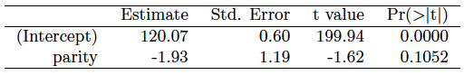
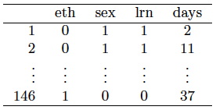
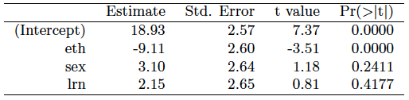
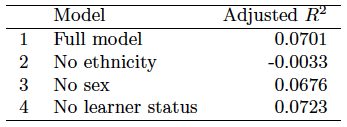
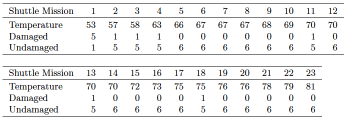
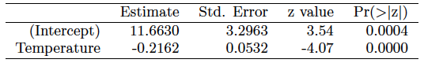
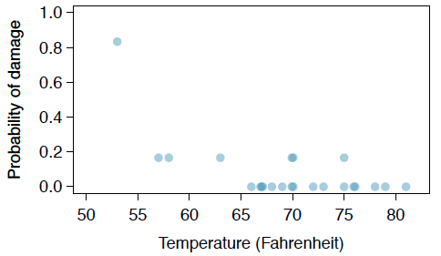
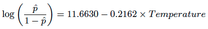
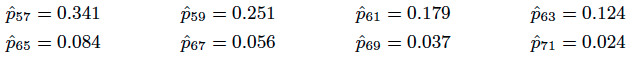

```{r setup, include=FALSE}
knitr::opts_chunk$set(echo = TRUE)
```

Graded: 8.2, 8.4, 8.8, 8.16, 8.18

## Exercise 8.2 Baby weights, Part II

Exercise 8.1 introduces a data set on birth weight of babies. Another variable we consider is parity, which is 0 if the child is the first born, and 1 otherwise. The summary table below shows the results of a linear regression model for predicting the average birth weight of babies, measured in ounces, from parity.



#####  (a) Write the equation of the regression line.

$$\hat{y} = 120.07 - 1.93 \times parity$$

#####  (b) Interpret the slope in this context, and calculate the predicted birth weight of first borns and others.

If parity equals 1 meaning the child is not the first born, then we would expect a 1.93 oz. lower birth weight than a first born child.

#####  (c) Is there a statistically significant relationship between the average birth weight and parity?

No, the p-value of 0.10 is larger than a 0.05 significance level, so we would not be surprised to get this value by chance alone.

## Exercise 8.4 Absenteeism

Researchers interested in the relationship between absenteeism from school and certain demographic characteristics of children collected data from 146 randomly sampled students in rural New South Wales, Australia, in a particular school year. Below are three observations from this data set.



The summary table below shows the results of a linear regression model for predicting the average number of days absent based on ethnic background (eth: 0 - aboriginal, 1 - not aboriginal), sex (sex: 0 - female, 1 - male), and learner status (lrn: 0 - average learner, 1 - slow learner).



#####  (a) Write the equation of the regression line.

$$\hat{y} = 18.93 - 9.11 \times eth + 3.10 \times sex + 2.15 \times lrn$$

#####  (b) Interpret each one of the slopes in this context.

- Non-aboriginal children are predicted to be absent 9.11 days less than aboriginal children keeping all other conditions constant.  
- Boys are predicted to be absent 3.1 days more than girls keeping all other conditions constant.  
- Slow learners are predicted to be absent 9.11 days more than average learners keeping all other conditions constant.  

#####  (c) Calculate the residual for the first observation in the data set: a student who is aboriginal, male, a slow learner, and missed 2 days of school.

```{r}
y = 18.93 - 9.11 * 0 + 3.10 * 1 + 2.15 * 1
# Residual = Observed value - Predicted value 
e = 2 - y
```

The residual for the first observation is `r e`.

#####  (d) The variance of the residuals is 240.57, and the variance of the number of absent days for all students in the data set is 264.17. Calculate the R2 and the adjusted R2. Note that there are 146 observations in the data set.

```{r}
r2 <- 1 - 240.57 / 264.17
```

$$R^2 = `r r2`$$

```{r}
adj_r2 <- 1 - (240.57 / 264.17) * ((146-1)/(146-3-1))
```

$$R^2_{adj} = `r adj_r2`$$

## Exercise 8.8 Absenteeism, Part II

Exercise 8.4 considers a model that predicts the number of days absent using three predictors: ethnic background (eth), gender (sex), and learner status (lrn). The table below shows the adjusted R-squared for the model as well as adjusted R-squared values for all models we evaluate in the first step of the backwards elimination process.



##### Which, if any, variable should be removed from the model first?

Removing learner status would increase the adjusted $R^2$ and make the model more accurate.

## Exercise 8.16 Challenger disaster, Part I

On January 28, 1986, a routine launch was anticipated for the Challenger space shuttle. Seventy-three seconds into the flight, disaster happened: the shuttle broke apart, killing all seven crew members on board. An investigation into the cause of the disaster focused on a critical seal called an O-ring, and it is believed that damage to these O-rings during a shuttle launch may be related to the ambient temperature during the launch. The table below summarizes observational data on O-rings for 23 shuttle missions, where the mission order is based on the temperature at the time of the launch. Temp gives the temperature in Fahrenheit, Damaged represents the number of damaged O-rings, and Undamaged represents the number of O-rings that were not damaged.



(a) Each column of the table above represents a different shuttle mission. Examine these data and describe what you observe with respect to the relationship between temperatures and damaged O-rings. 

The number of O-rings damaged seems to be strongly correlated with the temperature.  The only mission with more than one damaged O-ring also happens to be the only mission where the temperature fell below 57 degrees Fahrenheit.

(b) Failures have been coded as 1 for a damaged O-ring and 0 for an undamaged O-ring, and a logistic regression model was fit to these data. A summary of this model is given below. Describe the key components of this summary table in words.



A negative slope indicates a negative association between temperature and damaged O-rings.  The slope is statistically significant with a p-value of 0.  The following formula can be used to determine the probability of damaged O-rings at different temperatures:

$$p_i = \frac{e^{11.663 - 0.2162 \times temp}}{1+e^{11.663 - 0.2162 \times temp}}$$

```{r}
#probability of damaged O-rings at zero degrees
p_i_0 = exp(11.663)/(1+exp(11.663))
p_i_0
#probability of damaged O-rings at 50 degrees
p_i_50 = exp(11.663-0.2162*50)/(1+exp(11.663-0.2162*50))
p_i_50
#probability of damaged O-rings at 55 degrees
p_i_55 = exp(11.663-0.2162*55)/(1+exp(11.663-0.2162*55))
p_i_55
#probability of damaged O-rings at 60 degrees
p_i_60 = exp(11.663-0.2162*60)/(1+exp(11.663-0.2162*60))
p_i_60

```


(c) Write out the logistic model using the point estimates of the model parameters.

$$\log (\frac{p_i}{1-p_i}) = 11.663 - 0.2162 \times temperature$$

(d) Based on the model, do you think concerns regarding O-rings are justified? Explain.

Yes, based on the model O-rings are much more likely to become damaged and fail at temperatures below about 60 degrees Fahrenheit.  The probability of damage at 60 degrees is about 21.3%, but at 50 degrees the probability of damage is 70.1%.

## Exercise 8.18 Challenger disaster, Part II

Exercise 8.16 introduced us to O-rings that were identified as a plausible explanation for the breakup of the Challenger space shuttle 73 seconds into takeoff in 1986. The investigation found that the ambient temperature at the time of the shuttle launch was closely related to the damage of O-rings, which are a critical component of the shuttle. See this earlier exercise if you would like to browse the original data.



(a) The data provided in the previous exercise are shown in the plot. The logistic model fit to these data may be written as



where $\hat{p}$ is the model-estimated probability that an O-ring will become damaged. Use the model to calculate the probability that an O-ring will become damaged at each of the following ambient temperatures: 51, 53, and 55 degrees Fahrenheit. The model-estimated probabilities for several additional ambient temperatures are provided below, where subscripts indicate the temperature:



```{r}
#probability of damaged O-rings at 51 degrees
p_i_51 = exp(11.663-0.2162*51)/(1+exp(11.663-0.2162*51))
#probability of damaged O-rings at 53 degrees
p_i_53 = exp(11.663-0.2162*53)/(1+exp(11.663-0.2162*53))
#probability of damaged O-rings at 55 degrees
p_i_55 = exp(11.663-0.2162*55)/(1+exp(11.663-0.2162*55))
```

$$\hat{p}_{51} = `r round(p_i_51, 3)`$$
$$\hat{p}_{53} = `r round(p_i_53, 3)`$$
$$\hat{p}_{55} = `r round(p_i_55, 3)`$$

(b) Add the model-estimated probabilities from part (a) on the plot, then connect these dots using a smooth curve to represent the model-estimated probabilities.

```{r}
temps <- c(seq(51, 71, 2))
p <- exp(11.663-0.2162*temps)/(1+exp(11.663-0.2162*temps))
plot(data.frame(temps, p), type = "b", pch = 19, col = "red")
```


(c) Describe any concerns you may have regarding applying logistic regression in this application, and note any assumptions that are required to accept the model’s validity.

The conditions for logistic regression are hard to check in this case.  The condition that each predictor is linearly related to $\text{logit}(p_i)$ if all other predictors are held constant is difficult to check with a very limited amount of data additionally we would need to assume independence of outcomes to satisfy the second condition.